# VROOM

**Virtual Remoting Over OpenMux**

*It's like having a Zoom call with your coding agent.*

Version: 0.1.0-draft | Status: Draft | Date: 2026-02-14

---

## What is VROOM?

VROOM is a WebRTC-native protocol and runtime for interactive sessions with AI agents. You see what the agent sees (browser, terminal, desktop), hear it speak, talk to it by voice or text, and take over its screen with your mouse and keyboard — all in real-time over a single WebRTC connection.

VROOM is an application protocol built on [OpenMux](https://github.com/visionik/socketpipe/tree/openmux), a transport-agnostic channel multiplexing standard.

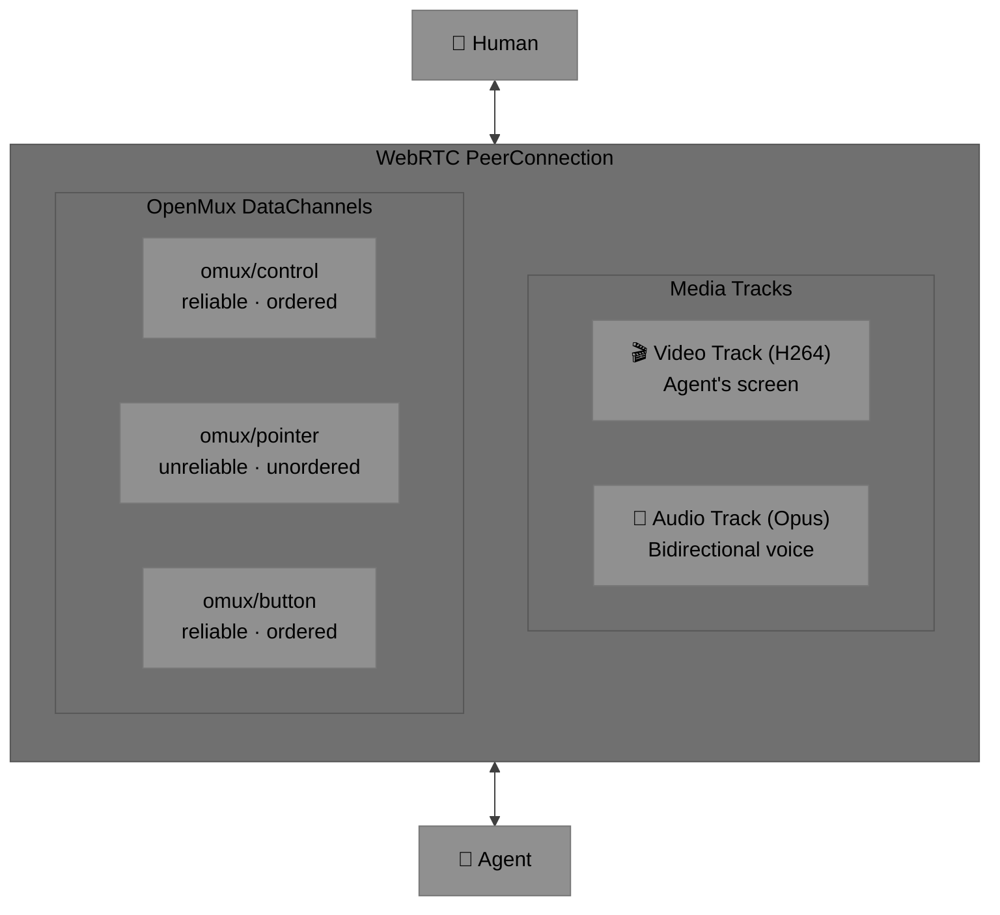

**One connection. Video, audio, and full bidirectional control.**

---

## Interaction Modes

VROOM supports three modes, switchable at runtime via the MODE message:

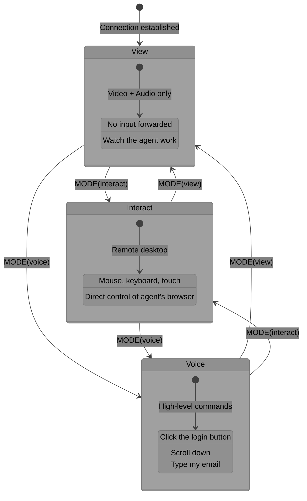

| Mode | Description | Channels Active | Input Types |
|------|-------------|----------------|-------------|
| **View** | Watch the agent work. No input forwarded. Default on connect. | `control` only | — |
| **Interact** | Remote desktop. Direct mouse/keyboard control of the agent's screen. | `control` + `pointer` + `button` | Mouse, keyboard, touch |
| **Voice** | High-level commands via voice or chat. Agent interprets intent. | `control` only | Structured commands |

---

## OpenMux Channels

VROOM defines three OpenMux channels. The `pointer` and `button` channels are opened lazily — only when the user enters Interact mode.

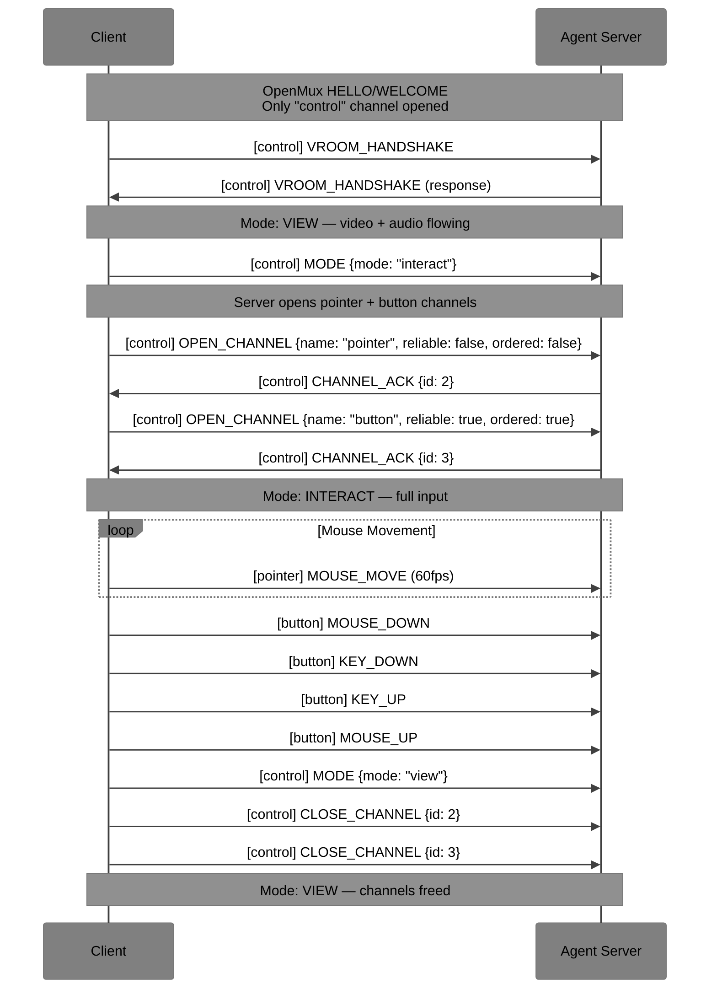

---

### Channel: `omux/control` — Reliable, Ordered

Session control, mode switching, clipboard, navigation, high-level commands, and agent state. JSON payloads for readability and extensibility.

#### Message Types

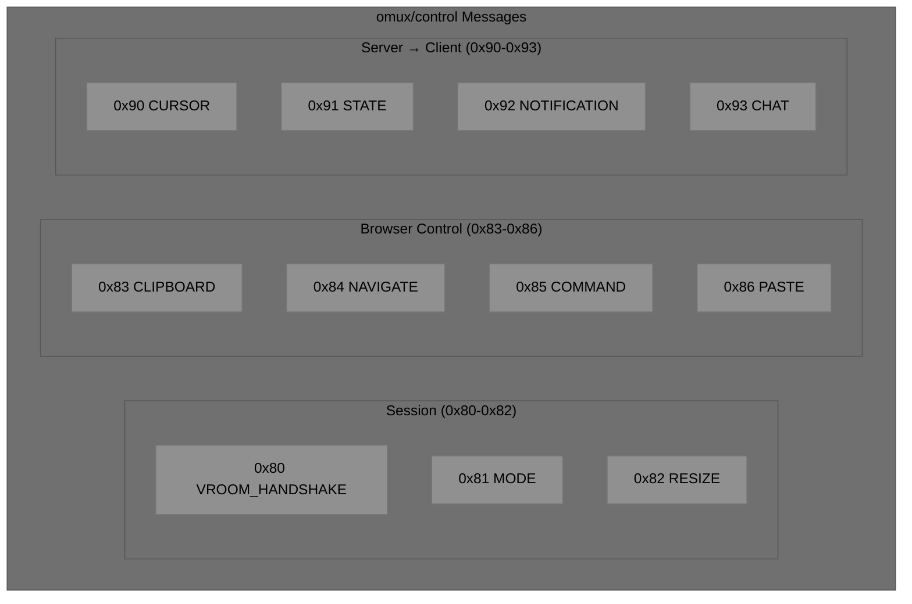

| Type | Name | Direction | Payload | Description |
|------|------|-----------|---------|-------------|
| `0x80` | VROOM_HANDSHAKE | Both | JSON | VROOM-level handshake (after OpenMux HELLO/WELCOME) |
| `0x81` | MODE | C→S | JSON | Switch interaction mode |
| `0x82` | RESIZE | C→S | JSON | Client viewport changed |
| `0x83` | CLIPBOARD | Both | JSON | Clipboard get/set |
| `0x84` | NAVIGATE | C→S | JSON | Navigate agent's browser to URL |
| `0x85` | COMMAND | C→S | JSON | High-level voice/chat command |
| `0x86` | PASTE | C→S | JSON | Paste text at current focus |
| `0x90` | CURSOR | S→C | JSON | Agent's cursor state (position, shape) |
| `0x91` | STATE | S→C | JSON | Agent state update |
| `0x92` | NOTIFICATION | S→C | JSON | Toast/alert from agent |
| `0x93` | CHAT | Both | JSON | Text chat message |

---

#### VROOM_HANDSHAKE (0x80)

Exchanged immediately after OpenMux HELLO/WELCOME. Establishes VROOM-specific capabilities.

**Client → Server:**

```json
{
  "version": "0.1.0",
  "capabilities": ["pointer", "keyboard", "touch", "clipboard", "command"],
  "viewport": {
    "width": 1024,
    "height": 1024,
    "scale": 1.0,
    "pixelRatio": 2.0
  },
  "mode": "view",
  "client": {
    "name": "vroom-web",
    "version": "0.1.0",
    "platform": "browser"
  }
}
```

| Field | Type | Required | Description |
|-------|------|----------|-------------|
| `version` | string | MUST | VROOM protocol version (semver) |
| `capabilities` | string[] | MUST | Input capabilities the client supports |
| `viewport` | Viewport | MUST | Client's display dimensions |
| `mode` | string | SHOULD | Initial mode. Default: `"view"` |
| `client` | object | MAY | Client implementation info |

**Server → Client:**

```json
{
  "version": "0.1.0",
  "capabilities": ["pointer", "keyboard", "clipboard", "command", "cursor"],
  "viewport": {
    "width": 1024,
    "height": 1024
  },
  "agent": {
    "name": "Vinston",
    "state": "idle",
    "browser": true
  }
}
```

| Field | Type | Required | Description |
|-------|------|----------|-------------|
| `version` | string | MUST | Server's VROOM version |
| `capabilities` | string[] | MUST | Capabilities the server supports |
| `viewport` | Viewport | MUST | Agent's render viewport |
| `agent` | object | MAY | Agent identity and state |

**Capability strings:**

| Capability | Description |
|-----------|-------------|
| `pointer` | Mouse/trackpad input |
| `keyboard` | Keyboard input |
| `touch` | Touch input |
| `clipboard` | Clipboard sync |
| `command` | High-level structured commands (voice mode) |
| `cursor` | Server sends cursor position/shape updates |
| `gamepad` | Gamepad/controller input (future) |

---

#### MODE (0x81) — Client → Server

```json
{
  "mode": "interact"
}
```

| Field | Type | Required | Description |
|-------|------|----------|-------------|
| `mode` | `"view"` \| `"interact"` \| `"voice"` | MUST | Target mode |

When switching to `interact`, the client SHOULD open `omux/pointer` and `omux/button` channels (if not already open). When switching away from `interact`, the client SHOULD close them.

---

#### RESIZE (0x82) — Client → Server

```json
{
  "width": 1920,
  "height": 1080,
  "scale": 1.0,
  "pixelRatio": 2.0
}
```

| Field | Type | Required | Description |
|-------|------|----------|-------------|
| `width` | number | MUST | Viewport width in logical pixels |
| `height` | number | MUST | Viewport height in logical pixels |
| `scale` | number | MAY | CSS scale factor. Default: 1.0 |
| `pixelRatio` | number | MAY | Device pixel ratio. Default: 1.0 |

The server MAY resize its rendering viewport to match, or MAY ignore this and let the client scale.

---

#### CLIPBOARD (0x83) — Bidirectional

```json
{
  "direction": "set",
  "text": "copied text content",
  "mimeType": "text/plain"
}
```

| Field | Type | Required | Description |
|-------|------|----------|-------------|
| `direction` | `"set"` \| `"get"` \| `"push"` | MUST | `set` = client→agent clipboard, `get` = request agent's clipboard, `push` = agent→client clipboard |
| `text` | string | MUST (for set/push) | Clipboard content |
| `mimeType` | string | MAY | Content type. Default: `text/plain` |

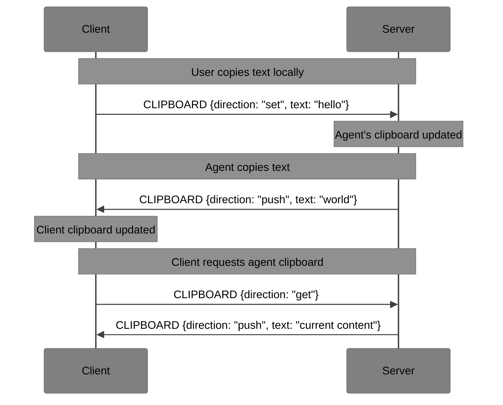

---

#### NAVIGATE (0x84) — Client → Server

```json
{
  "url": "https://github.com",
  "newTab": false
}
```

| Field | Type | Required | Description |
|-------|------|----------|-------------|
| `url` | string | MUST | URL to navigate to |
| `newTab` | boolean | MAY | Open in new tab. Default: false |

---

#### COMMAND (0x85) — Client → Server

Structured high-level commands for Voice mode. The agent translates these to browser/system actions.

```json
{
  "id": "cmd_1",
  "action": "click",
  "selector": "text=Sign In"
}
```

| Field | Type | Required | Description |
|-------|------|----------|-------------|
| `id` | string | SHOULD | Command ID for response correlation |
| `action` | string | MUST | Action type (see below) |
| *(varies)* | — | — | Action-specific fields |

**Action types:**

| Action | Fields | Example |
|--------|--------|---------|
| `click` | `selector` | `{"action": "click", "selector": "text=Sign In"}` |
| `type` | `selector`, `text` | `{"action": "type", "selector": "input[name=email]", "text": "me@example.com"}` |
| `scroll` | `direction`, `amount` | `{"action": "scroll", "direction": "down", "amount": 3}` |
| `navigate` | `url` | `{"action": "navigate", "url": "https://github.com"}` |
| `back` | — | `{"action": "back"}` |
| `forward` | — | `{"action": "forward"}` |
| `refresh` | — | `{"action": "refresh"}` |
| `screenshot` | — | `{"action": "screenshot"}` |
| `select` | `selector`, `values` | `{"action": "select", "selector": "#country", "values": ["US"]}` |
| `hover` | `selector` | `{"action": "hover", "selector": "text=Menu"}` |
| `wait` | `selector`, `state` | `{"action": "wait", "selector": "#results", "state": "visible"}` |
| `evaluate` | `expression` | `{"action": "evaluate", "expression": "document.title"}` |
| `natural` | `text` | `{"action": "natural", "text": "find the search box and type hello"}` |

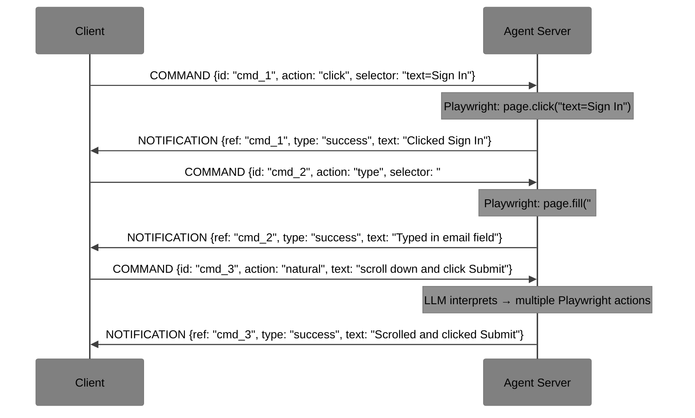

---

#### PASTE (0x86) — Client → Server

```json
{
  "text": "pasted text content"
}
```

Pastes text at the current focus point in the agent's browser. Different from CLIPBOARD — PASTE actively types the text, CLIPBOARD syncs the clipboard buffer.

---

#### CURSOR (0x90) — Server → Client

```json
{
  "type": "pointer",
  "x": 512,
  "y": 300,
  "visible": true
}
```

| Field | Type | Required | Description |
|-------|------|----------|-------------|
| `type` | string | MUST | CSS cursor type: `default`, `pointer`, `text`, `grab`, `crosshair`, `wait`, etc. |
| `x` | number | MUST | Cursor X position in viewport pixels |
| `y` | number | MUST | Cursor Y position in viewport pixels |
| `visible` | boolean | MAY | Whether cursor is visible. Default: true |

The client MAY render a remote cursor overlay on the video. In Interact mode, this shows where the user's input is targeting. In View mode, this shows where the agent is acting.

---

#### STATE (0x91) — Server → Client

```json
{
  "state": "browsing",
  "url": "https://github.com",
  "title": "GitHub",
  "loading": false,
  "browser": {
    "canGoBack": true,
    "canGoForward": false
  }
}
```

| Field | Type | Required | Description |
|-------|------|----------|-------------|
| `state` | string | MUST | Agent state: `idle`, `thinking`, `browsing`, `speaking`, `listening`, `coding` |
| `url` | string | MAY | Current browser URL |
| `title` | string | MAY | Current page title |
| `loading` | boolean | MAY | Whether page is loading |
| `browser` | object | MAY | Browser navigation state |

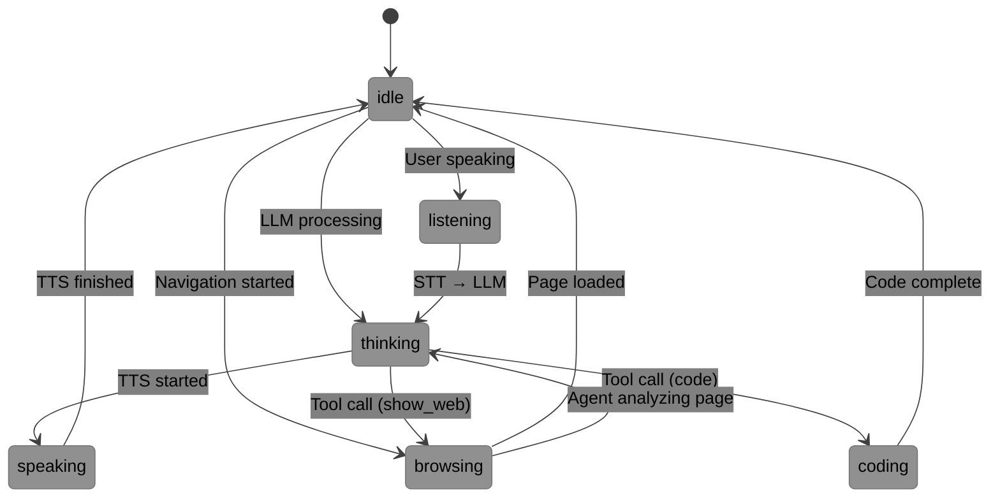

---

#### NOTIFICATION (0x92) — Server → Client

```json
{
  "ref": "cmd_1",
  "type": "success",
  "text": "Clicked Sign In button",
  "timestamp": 1707900000
}
```

| Field | Type | Required | Description |
|-------|------|----------|-------------|
| `ref` | string | MAY | Reference to a COMMAND id |
| `type` | `"info"` \| `"success"` \| `"warning"` \| `"error"` | MUST | Notification severity |
| `text` | string | MUST | Human-readable message |
| `timestamp` | number | MAY | Unix timestamp |

---

#### CHAT (0x93) — Bidirectional

```json
{
  "role": "user",
  "text": "Can you open the settings page?",
  "timestamp": 1707900000
}
```

| Field | Type | Required | Description |
|-------|------|----------|-------------|
| `role` | `"user"` \| `"agent"` \| `"system"` | MUST | Message sender |
| `text` | string | MUST | Message content |
| `timestamp` | number | MAY | Unix timestamp |

Text chat alongside voice — the agent can respond via TTS (audio track) and/or CHAT message.

---

### Channel: `omux/pointer` — Unreliable, Unordered

High-frequency mouse/touch movement. Binary-packed for minimal overhead. Loss-tolerant — stale position events are irrelevant once a newer one arrives.

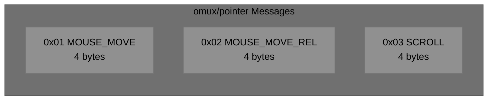

#### MOUSE_MOVE (0x01) — Client → Server

Absolute mouse position.

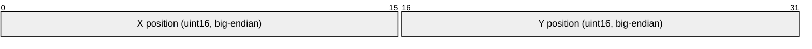

| Field | Size | Type | Description |
|-------|------|------|-------------|
| X | 2 bytes | uint16 | Horizontal position in viewport pixels |
| Y | 2 bytes | uint16 | Vertical position in viewport pixels |

**Total: 4 bytes payload + 6 bytes header = 10 bytes on wire.**

Coordinates are relative to the agent's viewport (0,0 = top-left). Client MUST scale from its display coordinates to the agent's viewport coordinates.

#### MOUSE_MOVE_REL (0x02) — Client → Server

Relative mouse movement (pointer lock / FPS mode).

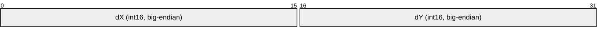

| Field | Size | Type | Description |
|-------|------|------|-------------|
| dX | 2 bytes | int16 | Horizontal delta (positive = right) |
| dY | 2 bytes | int16 | Vertical delta (positive = down) |

Used when the client has pointer lock (e.g., gaming, 3D navigation).

#### SCROLL (0x03) — Client → Server

Scroll / wheel event.


| Field | Size | Type | Description |
|-------|------|------|-------------|
| dX | 2 bytes | int16 | Horizontal scroll (positive = right) |
| dY | 2 bytes | int16 | Vertical scroll (positive = down) |

Values represent scroll delta in pixels. The server normalizes to its scrolling implementation.

---

### Channel: `omux/button` — Reliable, Ordered

Discrete input events — clicks, keypresses, touch start/end. Every event MUST arrive, in order.

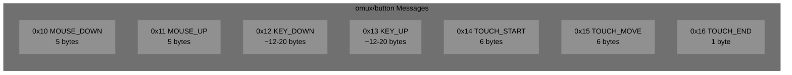

#### MOUSE_DOWN (0x10) / MOUSE_UP (0x11) — Client → Server

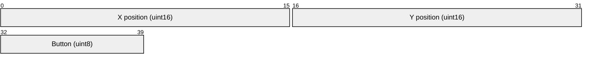

| Field | Size | Type | Description |
|-------|------|------|-------------|
| X | 2 bytes | uint16 | Click X position |
| Y | 2 bytes | uint16 | Click Y position |
| Button | 1 byte | uint8 | Button code (see below) |

**Button codes:**

| Code | Button |
|------|--------|
| 0 | Left (primary) |
| 1 | Middle |
| 2 | Right (secondary) |
| 3 | Back (browser back) |
| 4 | Forward (browser forward) |

Position is included with click events (not just inferred from last MOUSE_MOVE) to guarantee accuracy even if pointer events were dropped on the unreliable channel.

#### KEY_DOWN (0x12) / KEY_UP (0x13) — Client → Server

Variable-length keyboard events using DOM `key` and `code` strings.

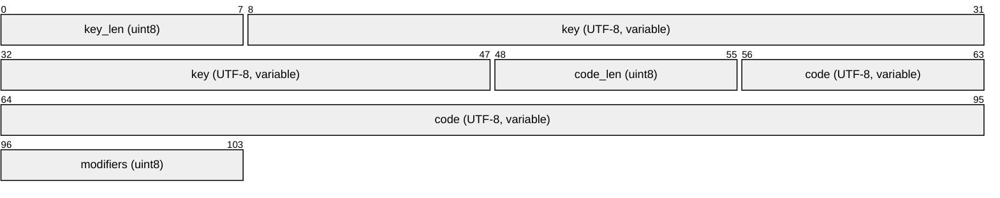

| Field | Size | Type | Description |
|-------|------|------|-------------|
| key_len | 1 byte | uint8 | Length of `key` string |
| key | variable | UTF-8 | DOM `KeyboardEvent.key` value (e.g., `"a"`, `"Enter"`, `"Shift"`) |
| code_len | 1 byte | uint8 | Length of `code` string |
| code | variable | UTF-8 | DOM `KeyboardEvent.code` value (e.g., `"KeyA"`, `"Enter"`, `"ShiftLeft"`) |
| modifiers | 1 byte | uint8 | Modifier bitmask |

**Why DOM `key`/`code` instead of X11 keysyms?**

VROOM targets Playwright's browser API. DOM values map directly:

```
KEY_DOWN: key="a", code="KeyA"       → page.keyboard.down("a")
KEY_DOWN: key="Enter", code="Enter"  → page.keyboard.down("Enter")
KEY_DOWN: key="Tab", code="Tab"      → page.keyboard.down("Tab")
```

No translation table needed. X11 keysyms (used by n.eko and Selkies) would require a mapping layer.

**Modifier bitmask:**

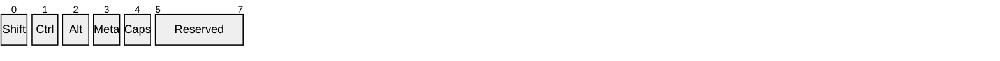

| Bit | Modifier |
|-----|----------|
| 0 | Shift |
| 1 | Ctrl / Control |
| 2 | Alt / Option |
| 3 | Meta / Cmd / Windows |
| 4 | CapsLock |
| 5-7 | Reserved (MUST be 0) |

The modifier byte is redundant with the key/code fields (e.g., a Shift key-down event will have `key="Shift"` AND bit 0 set). This is intentional — the bitmask provides a fast path for the server to check modifier state without parsing the key string.

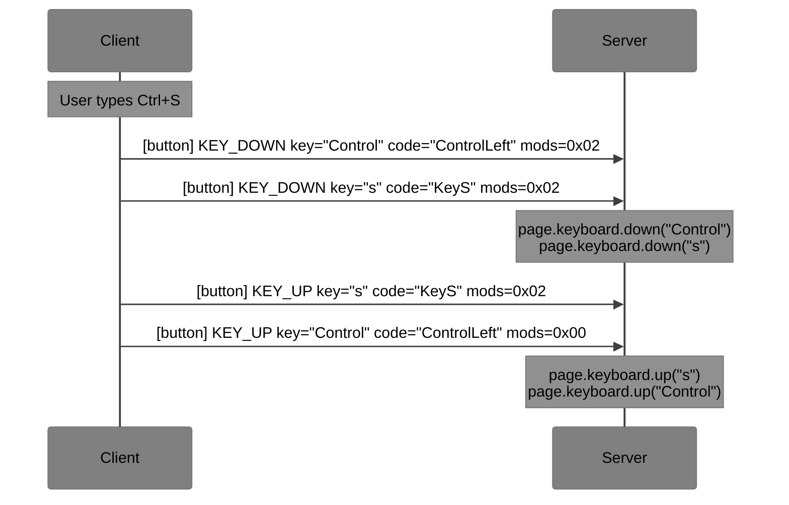

#### TOUCH_START (0x14) — Client → Server

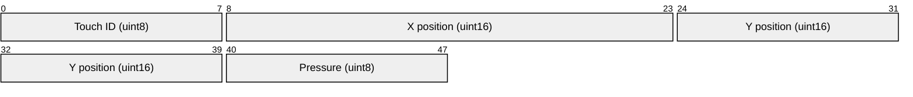

| Field | Size | Type | Description |
|-------|------|------|-------------|
| Touch ID | 1 byte | uint8 | Unique touch point identifier (0-255) |
| X | 2 bytes | uint16 | Touch X position |
| Y | 2 bytes | uint16 | Touch Y position |
| Pressure | 1 byte | uint8 | Touch pressure (0-255, 0 = no pressure data) |

#### TOUCH_MOVE (0x15) — Client → Server

Same format as TOUCH_START. Sent on the `button` channel (reliable) rather than `pointer` because touch gestures require ordered delivery for correct interpretation.

#### TOUCH_END (0x16) — Client → Server

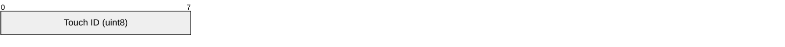

| Field | Size | Type | Description |
|-------|------|------|-------------|
| Touch ID | 1 byte | uint8 | Touch point that ended |

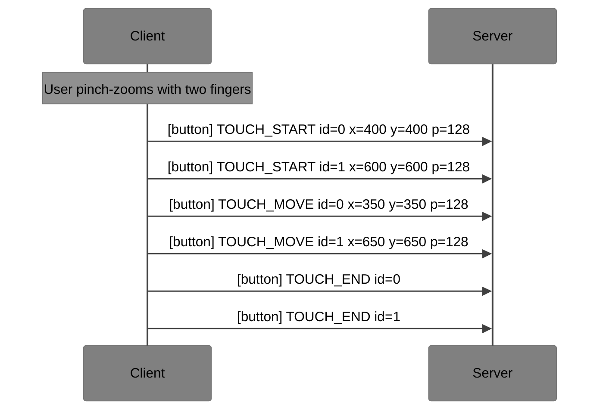

---

## Connection Flow

Complete end-to-end flow from signaling to interactive session:

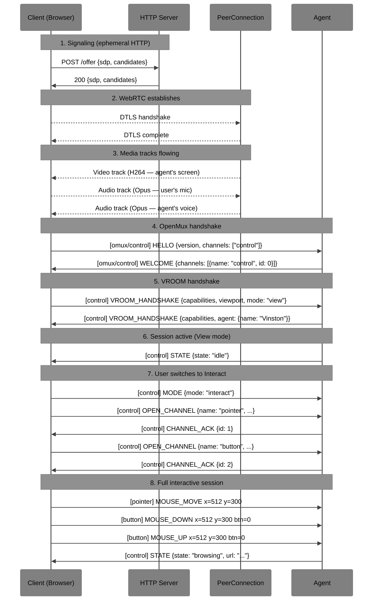

---

## Coordinate System

```mermaid
%%{init: {'theme': 'base', 'themeVariables': {'primaryTextColor': '#000000', 'secondaryTextColor': '#000000', 'tertiaryTextColor': '#000000', 'noteTextColor': '#000000', 'primaryColor': '#909090', 'secondaryColor': '#808080', 'tertiaryColor': '#707070', 'lineColor': '#404040'}}}%%
graph TD
    subgraph "Agent Viewport (1024×1024)"
        O["(0,0)"] --- TR["(1024,0)"]
        O --- BL["(0,1024)"]
        BL --- BR["(1024,1024)"]
        CP["(512,512)<br/>center"]
    end
```

- Origin: top-left (0, 0)
- X increases rightward
- Y increases downward
- Coordinates are in the **agent's viewport space** (not the client's display)
- Client MUST scale: `agent_x = (client_x / client_width) * agent_width`

---

## Fallback (WebSocket)

If WebRTC fails, VROOM falls back to WebSocket:

```
wss://host/vroom
```

```mermaid
%%{init: {'theme': 'base', 'themeVariables': {'primaryTextColor': '#000000', 'secondaryTextColor': '#000000', 'tertiaryTextColor': '#000000', 'noteTextColor': '#000000', 'primaryColor': '#909090', 'secondaryColor': '#808080', 'tertiaryColor': '#707070', 'lineColor': '#404040'}}}%%
graph TD
    subgraph "WebRTC Mode (preferred)"
        WR1["Video: MediaTrack"]
        WR2["Audio: MediaTrack"]
        WR3["Input: DataChannels"]
    end

    subgraph "WebSocket Fallback"
        WS1["Video: JPEG frames on omux/video channel"]
        WS2["Audio: text-only (no voice)"]
        WS3["Input: same OpenMux frames, multiplexed"]
    end

    F{WebRTC<br/>available?}
    F -->|Yes| WR1
    F -->|No| WS1
```

In WebSocket mode:
- All OpenMux channels multiplex over one connection
- Video degrades to server-pushed JPEG frames on a dedicated `omux/video` channel
- Audio falls back to text-only chat (CHAT messages)
- All input messages use identical binary format

---

## Design Lineage

VROOM's input protocol was designed after studying four existing projects:

```mermaid
%%{init: {'theme': 'base', 'themeVariables': {'primaryTextColor': '#000000', 'secondaryTextColor': '#000000', 'tertiaryTextColor': '#000000', 'noteTextColor': '#000000', 'primaryColor': '#909090', 'secondaryColor': '#808080', 'tertiaryColor': '#707070', 'lineColor': '#404040'}}}%%
graph TB
    N["n.eko<br/>JSON / WebSocket<br/>X11 keysyms"]
    S["Selkies-GStreamer<br/>CSV / DataChannel<br/>X11 keysyms"]
    J["JetKVM<br/>Binary / DataChannel<br/>USB HID scancodes"]
    SP["SocketPipe<br/>Binary frames / WebSocket<br/>Terminal I/O"]

    V["VROOM<br/>Binary + JSON / DataChannel<br/>DOM key/code"]

    N -->|"Named event types<br/>Debuggable control channel"| V
    S -->|"Compact hot-path<br/>Relative mouse support"| V
    J -->|"Separate queues per input type<br/>Binary efficiency"| V
    SP -->|"Transport abstraction<br/>Frame format"| V
```

| Project | Insight Borrowed |
|---------|-----------------|
| **n.eko** | Named event types, JSON for control messages, debuggability |
| **Selkies-GStreamer** | Compact binary for hot-path mouse events, relative mouse mode |
| **JetKVM** | Separate channels per input type with independent reliability |
| **SocketPipe** | Transport-agnostic binary framing → evolved into OpenMux |

---

## Reference Implementation

The reference implementation is [voxio-bot](https://github.com/visionik/voxio-bot) (being renamed to vroom-server), built on:

- **Pipecat** — AI pipeline framework (LLM, TTS, STT)
- **aiortc** — Python WebRTC implementation
- **Playwright** — Headless browser for agent screen rendering

## Status

VROOM is in active development. The protocol is draft and subject to change.

## License

MIT
