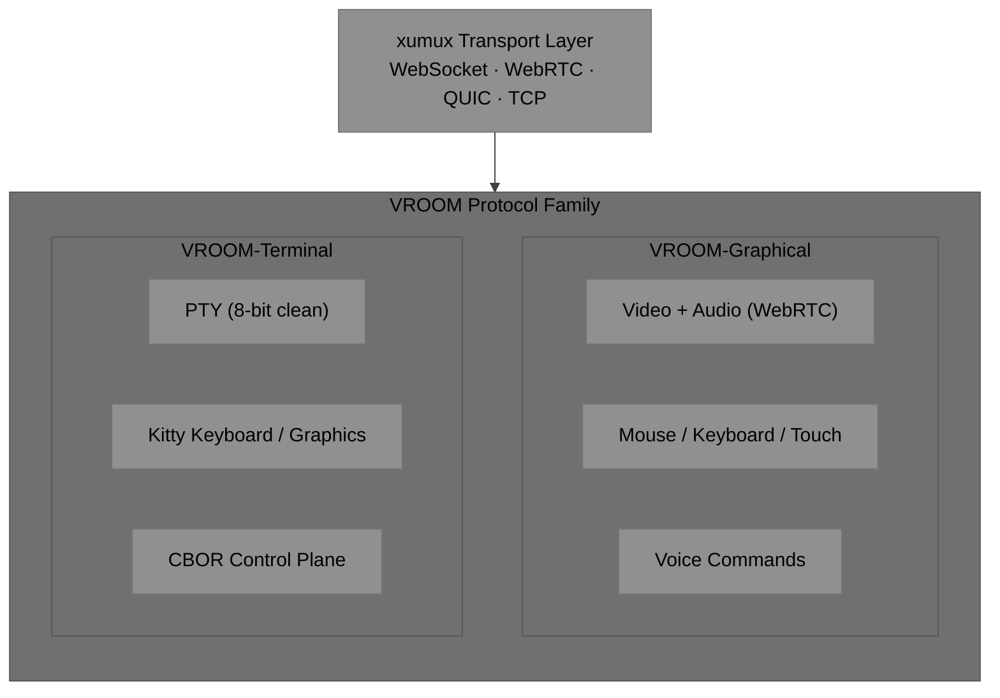

# VROOM

**Virtual Remoting Over Open Methods**

Version: 0.2.0-draft | Status: Draft | Date: 2026-03-28

---

## What is VROOM?

VROOM is a protocol family and runtime for interactive sessions with AI agents, built on [xumux](https://xumux.org), a transport-agnostic channel multiplexing standard.

VROOM comprises companion protocols that can run over the same xumux connection:

| Protocol | Spec | Description |
|----------|------|-------------|
| **VROOM-Graphical** | [VROOM-Graphical.md](./VROOM-Graphical.md) | Remote desktop/browser access — video, audio, mouse, keyboard, touch, voice commands |
| **VROOM-Terminal** | [VROOM-Terminal.md](./VROOM-Terminal.md) | Terminal access — PTY, capability negotiation, Kitty keyboard/graphics, CBOR control plane |
| **VROOM-Structural** | [VROOM-Structural.md](./VROOM-Structural.md) | Structured UI tree for agents — one IR; hosts map AX / UIA / AT-SPI; pixel fallback |

```mermaid
%%{init: {'theme': 'base', 'themeVariables': {'primaryTextColor': '#000000', 'secondaryTextColor': '#000000', 'tertiaryTextColor': '#000000', 'noteTextColor': '#000000', 'primaryColor': '#909090', 'secondaryColor': '#808080', 'tertiaryColor': '#707070', 'lineColor': '#404040'}}}%%
graph TB
    subgraph VROOM["VROOM Protocol Family"]
        direction TB
        subgraph G["VROOM-Graphical"]
            G1["Video + Audio (WebRTC)"]
            G2["Mouse / Keyboard / Touch"]
            G3["Voice Commands"]
        end
        subgraph T["VROOM-Terminal"]
            T1["PTY (8-bit clean)"]
            T2["Kitty Keyboard / Graphics"]
            T3["CBOR Control Plane"]
        end
    end
    OM["xumux Transport Layer<br/>WebSocket · WebRTC · QUIC · TCP"] --> VROOM
```

## Architecture

- **Single `vroomd` daemon** supports both protocols simultaneously
- **Shared xumux connection** — graphical and terminal channels coexist
- **Thin gateways** (`vroom-to-ssh`, `ssh-to-vroom`) planned for adoption

## Reference Implementation

The reference implementation is [voxio-bot](https://github.com/visionik/voxio-bot) (being renamed to vroom-server), built on:

- **Pipecat** — AI pipeline framework (LLM, TTS, STT)
- **aiortc** — Python WebRTC implementation
- **Playwright** — Headless browser for agent screen rendering

## Status

VROOM is in active development. Both protocols are draft and subject to change.

## License

MIT
