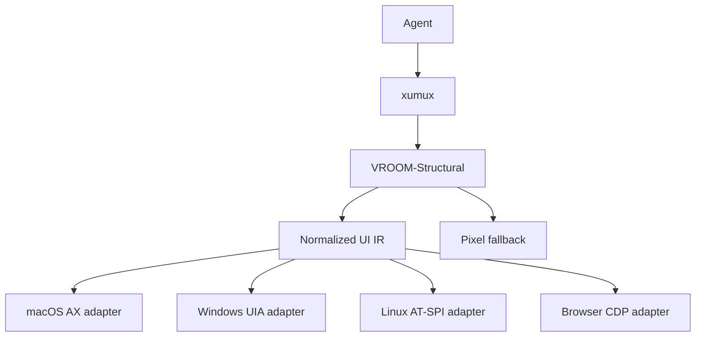
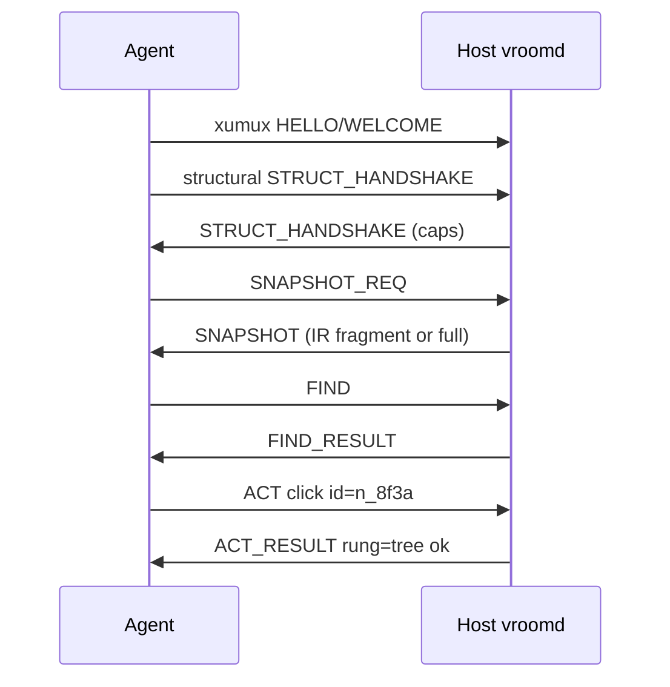

# VROOM-Structural

**Virtual Remoting Over Open Methods — Structural Protocol**

*One UI tree for agents. Hosts map it to AX, UIA, or AT-SPI (and pixels when the tree lies).*

Official Name: VROOM-Structural | Companions: [VROOM-Graphical](./VROOM-Graphical.md), [VROOM-Terminal](./VROOM-Terminal.md)
Version: 0.1.0-draft | Status: Draft | Date: 2026-09-06

---

## What is VROOM-Structural?

VROOM-Structural is the **structured UI access** protocol in the VROOM family. Agents see and act on a **normalized component tree** — roles, names, values, bounds, states, actions — not OS-specific Accessibility APIs and not raw pixels (unless the tree cannot serve the action).

| Protocol | Surface | Primary signal |
|----------|---------|----------------|
| **VROOM-Terminal** | Character grid / PTY | Bytes + control |
| **VROOM-Graphical** | Framebuffer + A/V | Video, pointer, voice |
| **VROOM-Structural** | Component tree | Snapshot / find / act (+ pixel fallback) |

VROOM-Structural is an application protocol on [xumux](https://xumux.org). It MAY share one xumux connection with Graphical and/or Terminal.



**Design rule:** agents speak **only** the IR and Structural messages. Per-OS translation happens **on the host**, on the fly. No `axRole` / `ControlType` / ATK role in the agent-facing schema.

---

## Goals

- One agent vocabulary across macOS, Windows, Linux, and browser (CDP)
- Prefer tree fidelity over vision when the platform exposes a usable node
- Explicit, negotiated pixel fallback when the tree is empty, stale, or canvas-like
- Reliable, ordered delivery for snapshots and acts (never ride the unreliable pointer channel)
- Coexist with VROOM-Graphical (human View/Interact) without requiring video for agent-only sessions

## Non-Goals

- Replacing Splashtop/Parsec for humans
- Defining LLM tool-calling JSON (that sits above Structural)
- Guaranteeing a rich tree for games, raw OpenGL/Metal canvases, or remote-desktop mirrors
- Shipping OS-specific message dialects to agents

---

## Intermediate Representation (IR)

The IR is an **ARIA-inspired** tree. Host adapters MUST map native nodes into this shape and MUST NOT leak native type enums into agent-visible fields (optional `native` debug bag is allowed only when `debug: true` in the session).

### Node

```json
{
  "id": "n_8f3a",
  "role": "button",
  "name": "Save",
  "value": null,
  "description": null,
  "states": ["enabled", "focusable"],
  "actions": ["click", "focus"],
  "bounds": { "x": 120, "y": 80, "w": 96, "h": 32, "space": "screen" },
  "children": ["n_8f3b"],
  "parent": "n_8f39",
  "attrs": {}
}
```

| Field | Type | Required | Notes |
|-------|------|----------|-------|
| `id` | string | MUST | Session-stable while the native backend id is stable; opaque to agents |
| `role` | Role | MUST | From the role enum below |
| `name` | string \| null | MUST | Accessible name; empty string → prefer `null` |
| `value` | string \| number \| boolean \| null | MUST | Current value when meaningful |
| `description` | string \| null | MAY | Help/ax description |
| `states` | string[] | MUST | From the state enum (may be empty) |
| `actions` | string[] | MUST | Invokable verbs the host can perform on this node |
| `bounds` | Bounds \| null | SHOULD | Screen or window space; null if unknown |
| `children` | string[] | MUST | Child ids in paint/tab order when known |
| `parent` | string \| null | MUST | Null for roots |
| `attrs` | object | MAY | IR-level only (e.g. `level` for headings, `selected` index). No OS enums |

### Bounds

```json
{ "x": 0, "y": 0, "w": 100, "h": 20, "space": "screen" }
```

`space`: `"screen"` \| `"window"` \| `"frame"`. Agents treat coordinates as host-local; Graphical RESIZE does not rewrite Structural ids.

### Roles (v1 closed set)

Agents MUST only emit/expect these roles. Hosts MUST map unknown native roles to the closest fit or `unknown`.

`window`, `dialog`, `sheet`, `alert`, `menu`, `menubar`, `menuitem`, `toolbar`, `tab`, `tablist`, `tabpanel`, `tree`, `treeitem`, `list`, `listitem`, `table`, `row`, `cell`, `grid`, `gridcell`, `group`, `region`, `scrollarea`, `scrollbar`, `splitter`, `slider`, `progressbar`, `statusbar`, `text`, `heading`, `link`, `button`, `checkbox`, `radio`, `switch`, `textbox`, `searchbox`, `combobox`, `spinbutton`, `image`, `icon`, `canvas`, `web`, `application`, `document`, `unknown`

### States (v1)

`enabled`, `disabled`, `focused`, `focusable`, `selected`, `checked`, `unchecked`, `mixed`, `expanded`, `collapsed`, `busy`, `hidden`, `offscreen`, `readonly`, `required`, `invalid`, `modal`, `pressed`

### Actions (v1)

`focus`, `click`, `double_click`, `right_click`, `set_value`, `clear`, `toggle`, `expand`, `collapse`, `scroll_into_view`, `press` (keyboard default activation)

Hosts SHOULD omit actions they cannot perform. Agents MUST NOT invent action names.

### Query language (FIND)

FIND uses a small declarative predicate (not CSS, not XPath) so hosts can compile to AX/UIA/AT-SPI efficiently.

```json
{
  "role": "button",
  "name": { "eq": "Save" },
  "states_all": ["enabled"],
  "ancestor": { "role": "dialog", "name": { "contains": "Settings" } },
  "limit": 10
}
```

Name match ops: `eq`, `contains`, `prefix`, `regex` (host MAY refuse `regex`).  
Boolean: `states_all`, `states_any`, `actions_any`.  
Scope: `root` (id), `ancestor` (nested query), `within` (id).

---

## Resolution ladder

For every ACT, the host MUST resolve in order and report which rung succeeded:

1. **Tree** — native action/pattern (AX press, UIA Invoke, ATK doAction)
2. **Hybrid** — tree bounds exist → synthesize click/type at bounds center (or focused node)
3. **Pixel** — only if client allowed `pixel_fallback` and tree/hybrid failed → screenshot region + vision/OCR path local to host or delegated as `PIXEL_NEED`

Agents SHOULD prefer FIND → ACT with `id` over raw coordinates. Coordinates are always a degradation.

---

## xumux Channels

| Channel | Reliability | Purpose |
|---------|-------------|---------|
| `omux/structural` | **Reliable, ordered** | All Structural messages (HELLO, SNAPSHOT, FIND, ACT, …) |
| `omux/control` | Reliable, ordered | Optional shared session control if co-hosted with Graphical |
| WebRTC video (optional) | Media | Pixel frames when fallback or human View is active |

Structural MUST NOT use Graphical’s unreliable `pointer` channel for tree ops.



---

## Message types (`omux/structural`)

Encoding: **CBOR preferred**, JSON accepted (negotiated in STRUCT_HANDSHAKE), same policy as Graphical/Terminal.

| Code | Name | Dir | Body |
|------|------|-----|------|
| `0xA0` | STRUCT_HANDSHAKE | Both | versions, caps |
| `0xA1` | SNAPSHOT_REQ | C→S | depth, root, include |
| `0xA2` | SNAPSHOT | S→C | nodes[], root_ids[], rev, truncated? |
| `0xA3` | FIND | C→S | query |
| `0xA4` | FIND_RESULT | S→C | ids[], nodes? |
| `0xA5` | ACT | C→S | id \| bounds, action, args |
| `0xA6` | ACT_RESULT | S→C | ok, rung, error? |
| `0xA7` | EVENT | S→C | focus/value/structure deltas |
| `0xA8` | PIXEL_NEED | S→C | reason, region, capture_id |
| `0xA9` | PIXEL_RESULT | C→S or S→C | capture_id, hint or click |
| `0xAF` | ERROR | Both | code, message, detail? |

### STRUCT_HANDSHAKE (`0xA0`)

```json
{
  "protocol": "vroom-structural",
  "version": "0.1.0",
  "control_encoding": "cbor",
  "platforms": ["macos"],
  "adapters": ["ax"],
  "pixel_fallback": true,
  "max_snapshot_bytes": 1048576,
  "roles": ["button", "textbox", "..."],
  "actions": ["click", "set_value", "..."]
}
```

Server response MUST echo negotiated caps. `platforms` / `adapters` are informational (one host, one primary adapter). Browser sessions advertise `adapters: ["cdp"]` (optionally alongside an OS adapter if the host also exposes desktop a11y). Client may set `pixel_fallback: false` to forbid rung 3.

### SNAPSHOT_REQ (`0xA1`) / SNAPSHOT (`0xA2`)

```json
{
  "root": null,
  "depth": 8,
  "include": ["bounds", "actions", "states"],
  "omit_hidden": true
}
```

```json
{
  "rev": 42,
  "root_ids": ["n_root"],
  "nodes": [ { "...": "Node" } ],
  "truncated": false,
  "partial": false
}
```

Large trees: host MAY send multiple SNAPSHOT messages with `partial: true` then a final `partial: false`, same `rev`. Clients MUST assemble by `id`.

### FIND (`0xA3`) / FIND_RESULT (`0xA4`)

See query language. FIND_RESULT MAY inline matching nodes or only ids (client then uses cached SNAPSHOT).

### ACT (`0xA5`) / ACT_RESULT (`0xA6`)

```json
{
  "request_id": "r1",
  "target": { "id": "n_8f3a" },
  "action": "click",
  "args": {}
}
```

Or degraded:

```json
{
  "request_id": "r2",
  "target": { "bounds": { "x": 10, "y": 10, "w": 1, "h": 1, "space": "screen" } },
  "action": "click"
}
```

```json
{
  "request_id": "r1",
  "ok": true,
  "rung": "tree",
  "rev": 43
}
```

`rung`: `"tree"` \| `"hybrid"` \| `"pixel"` \| `"none"`.

### EVENT (`0xA7`)

Optional push updates: focus changes, value changes, subtree invalidate. Clients MAY ignore and re-SNAPSHOT.

### PIXEL_NEED / PIXEL_RESULT (`0xA8` / `0xA9`)

Used when `pixel_fallback` is on and tree/hybrid cannot complete an ACT (or client requested a capture). Host MAY run vision locally and only emit ACT_RESULT; PIXEL_* is for split brain (model on client).

---

## Host adapter contract

| Platform | Native API | Notes |
|----------|------------|-------|
| macOS | Accessibility (`AXUIElement`) + ScreenCapture/Peekaboo | First reference adapter; align with fox aqua |
| Windows | UI Automation (UIA) | Prefer UIA over MSAA |
| Linux | AT-SPI2 | Best-effort; declare weak coverage in handshake |
| Browser | CDP (`Accessibility.getFullAXTree` + DOM bounds) | Same IR — not a separate VROOM-Browser protocol |

Adapters MUST:

1. Map native → IR roles/states/actions
2. Maintain `id` stability for the session when the backend allows
3. Implement the resolution ladder
4. Never require the agent to send native identifiers

Adapters SHOULD expose `canvas` / `web` roles when the subtree is opaque so agents know to expect pixel fallback.

### Browser / CDP adapter

CDP is **another host adapter**, not a second agent dialect. Handshake MAY advertise `adapters: ["cdp"]` and `platforms: ["browser"]` (or the embedding OS plus browser).

Map, in order of preference:

1. CDP Accessibility tree (`Accessibility.getFullAXTree`) → IR roles/states/names
2. DOM fallback for bounds (`DOM.getBoxModel` / `getContentQuads`) when AX bounds are missing
3. Pixel rung for `canvas` / WebGL / empty AX

Hosts SHOULD:

- Flatten or nest iframes/shadow roots explicitly (`attrs.frame_id`, `attrs.shadow` as IR attrs — still no raw CDP ids in required fields)
- Treat SPA virtualization as stale-tree: emit EVENT or bump `rev` and let clients re-SNAPSHOT
- Keep CSS selectors / `backendNodeId` in the optional `native` debug bag only when `debug: true`

Agents MUST NOT be required to speak CDP, CSS, or XPath to use Structural against a browser.


---

## Relationship to VROOM-Graphical

| Concern | Graphical | Structural |
|---------|-----------|------------|
| Human watch / voice | Yes | No (unless co-session) |
| Agent click-by-name | Via COMMAND prose | First-class FIND/ACT |
| Coordinates | Pointer stream | Last resort |
| Video required | Typical | Optional |

A session MAY open both. Structural acts SHOULD update the same desktop Graphical is streaming.

---

## Comparison: Structural vs raw AX/UIA vs vision-only

| | Per-OS a11y APIs | Vision-only | **VROOM-Structural** |
|--|------------------|-------------|----------------------|
| Agent portability | Poor | Good | **Good** |
| Click reliability on native widgets | High | Medium | **High (tree) → medium (pixel)** |
| Canvas/games | Poor | Required | Explicit fallback |
| Bandwidth | Low | High | Low for tree; burst on pixel |

---

## Reference implementation recommendations

### Server (`vroomd` Structural module)

- Same daemon family as Graphical/Terminal
- macOS: Peekaboo / AX bridge (fox aqua patterns)
- Windows: FlaUI or UIAutomationCore
- Linux: pyatspi / at-spi2
- CBOR via shared `vroom-protocol` codec

### Clients

- Agent runtimes (tool calls → STRUCT messages)
- Optional human debugger UI that renders the IR tree beside Graphical video

### Suggested build phases

1. Spec freeze (this document) + IR role/action enums
2. macOS adapter + SNAPSHOT/FIND/ACT happy path
3. Pixel fallback hook
4. Windows UIA adapter
5. Browser CDP adapter (same IR)
6. Linux AT-SPI adapter
7. EVENT streaming / diff snapshots

---

## Status

Draft 0.1.0. Subject to change. Part of the VROOM protocol family on xumux.

## License

MIT
