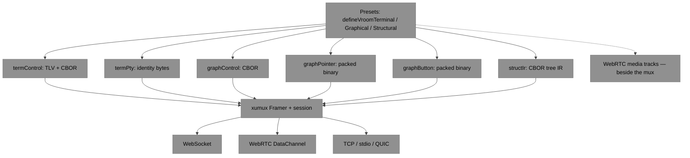
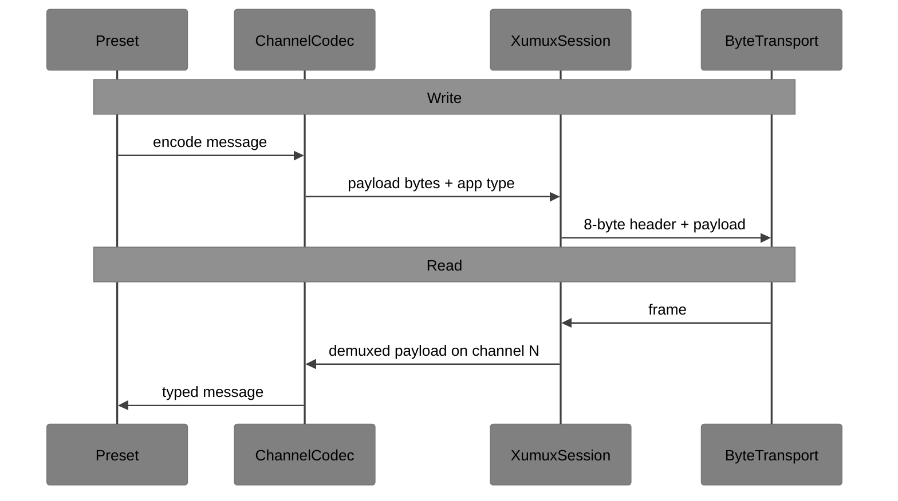

# VROOM I/O Stack

**How to implement VROOM protocols on xumux**

This document is an **implementation guide**. It is not a wire spec.

Normative channel names, message types, and encodings live in:

- [VROOM-Terminal.md](../VROOM-Terminal.md)
- [VROOM-Graphical.md](../VROOM-Graphical.md)
- [VROOM-Structural.md](../VROOM-Structural.md)

Mux framing, channel lifecycle, and transport bindings live in [xumux](https://xumux.org) ([spec repo](https://github.com/deftai/xumux)). The TypeScript mux implementation is [libxumux](https://github.com/deftai/libxumux).

---

## The bet

VROOM protocols are Subspace-style **presets** on an xumux session.

- **xumux** owns the underlay and frame demux: attach a byte transport, run the 8-byte header + fragmentation, assign channel IDs, honor reliability/ordering flags.
- **Each VROOM channel** owns its payload codec: TLV+CBOR, raw PTY bytes, packed pointer events, tree IR, and so on.

Do **not** put VROOM CBOR (or any VROOM payload encoding) at the xumux framer layer. The mux header is `[Channel:2][Type:1][Flags:1][Length:4]`. What follows is an opaque payload for that channel. Application codecs decode **after** demux.

One xumux session MAY host Terminal, Graphical, and Structural channels together.

---

## Subspace vocabulary (inspiration, not a dependency)

**Observation:** Deft’s internal Subspace I/O stack layers as `ByteTransport → Framer → Codec → Connection<TMessage>`, plus `MessageTransport` for in-process loops, middleware, and `define*` presets.

**Inference:** Those roles map cleanly onto VROOM-on-xumux. This document uses that vocabulary so implementors can share one mental model. Subspace is **not** a public dependency of VROOM. A VROOM stack needs xumux (or libxumux) plus per-channel codecs.

| Subspace role | VROOM-on-xumux |
|---------------|----------------|
| `ByteTransport` | WebSocket / WebRTC DataChannel / TCP / stdio / QUIC. Often **attach** after external dial or signaling. |
| `Framer` | xumux session: 8-byte header, channels, fragmentation. [libxumux](https://github.com/deftai/libxumux). |
| `Codec` | **Per channel**, after demux. Never at the mux framer. |
| `Connection<TMessage>` | Typed read/write view of one channel (or a preset’s bundle of channels). |
| `MessageTransport` | In-process / test underlay — typed messages, no bytes. |
| `define*` preset | `defineVroomTerminal` / `defineVroomGraphical` / `defineVroomStructural`: which channels to OPEN, flags, codec negotiation, thin control middleware. |

---

## Layers

The dashed media path is Graphical’s preferred A/V: H.264 / Opus tracks on the PeerConnection. They are **not** xumux frames. WebSocket fallback moves JPEG onto `omux/video` (then that channel *does* have a codec).

### 1. ByteTransport

A bidirectional byte (or datagram) pipe. xumux does **not** dial.

Typical attach:

1. Complete signaling / accept / `connect()` outside the mux (HTTP offer/answer, TCP listen, stdio spawn).
2. Hand the established socket or DataChannel to the xumux session.
3. On stream transports (TCP, stdio), send/validate the `OMUX` magic bytes, then frames. On message transports (WebSocket, WebRTC DC), no magic — see [xumux](https://xumux.org).

Bindings: [libxumux transport adapters](https://github.com/deftai/libxumux) (`WebSocketAdapter`, `WebRTCAdapter`, `TcpAdapter`, `StdioAdapter`, `QuicAdapter`).

### 2. xumux Framer + session

libxumux (or an equivalent) owns:

- 8-byte header and fragmentation / reassembly
- Channel 0 control: HELLO / WELCOME, OPEN_CHANNEL, keepalive, CLOSE
- Named channels with `reliable` / `ordered` flags
- Demux: incoming frames → the channel that owns the payload

xumux channel-0 control messages use JSON. That is **mux** control, not VROOM control. VROOM HELLO / VROOM_HANDSHAKE / STRUCT_HANDSHAKE ride on application channels after WELCOME.

### 3. Per-channel codecs

| Channel | Protocol | Codec | Notes |
|---------|----------|-------|-------|
| `vroom.terminal.control` | Terminal | TLV (8-byte type+length) + body | HELLO body is always JSON; then negotiated `control_encoding` (CBOR preferred). WINDOW_RESIZE / SIGNAL stay packed binary. See [VROOM-Terminal](../VROOM-Terminal.md). |
| `vroom.terminal.pty` | Terminal | Identity / raw bytes | 8-bit clean PTY master. No CBOR. |
| `omux/control` | Graphical | CBOR preferred, JSON accepted | Negotiated in VROOM_HANDSHAKE `control_encoding`. |
| `omux/pointer` | Graphical | Packed binary | Unreliable, unordered. Identity of *bytes* after the mux header; message type is the xumux Type byte. |
| `omux/button` | Graphical | Packed binary | Reliable, ordered clicks / keys / touch. |
| `omux/video` | Graphical (WS fallback) | JPEG frames | Only when WebRTC media is unavailable. |
| `omux/structural` | Structural | Tree IR; **CBOR preferred**, JSON accepted | Negotiated in STRUCT_HANDSHAKE. Reliable, ordered. MUST NOT ride Graphical’s pointer channel. See [VROOM-Structural](../VROOM-Structural.md). |

**Seam rule:** the mux `Type` byte on an application channel is whatever that protocol defines (MOUSE_MOVE, STRUCT_HANDSHAKE, …). The mux does not parse CBOR. The channel codec parses the payload — and, for Terminal control, the inner TLV header *inside* the xumux payload.

### 4. Presets

A preset is a constructor over an already-handshaken xumux session. Suggested names (implementations MAY differ):

| Preset | Opens | Flags | Negotiation | Middleware |
|--------|-------|-------|-------------|------------|
| `defineVroomTerminal` | `vroom.terminal.control`; `vroom.terminal.pty` after PTY_RESPONSE | Both reliable, ordered | Control HELLO JSON → `control_encoding` | Auth, capability offer/select, PTY/exec gates |
| `defineVroomGraphical` | `omux/control`; lazy `omux/pointer` + `omux/button` on Interact | Control/button reliable+ordered; pointer unreliable+unordered | VROOM_HANDSHAKE `control_encoding` | Auth/caps/mode on control only |
| `defineVroomStructural` | `omux/structural`; MAY share Graphical `omux/control` | Reliable, ordered | STRUCT_HANDSHAKE `control_encoding` | Caps / `pixel_fallback` on structural (or shared control) |

Presets do **not** replace xumux HELLO/WELCOME. They decide which application channels to request, which codec sits on each, and which thin hooks wrap control.

---

## Write / read path

PTY and pointer/button hot paths should be `identity` or packed-struct codecs — no JSON/CBOR parse on every byte or mouse sample.

---

## One session, three protocols

`vroomd` SHOULD accept a single xumux connection and OPEN only the channels the client requests.

- Graphical View: `omux/control` + WebRTC media (or `omux/video`).
- Interact: add `omux/pointer` + `omux/button`.
- Terminal: add `vroom.terminal.control` (+ PTY after allocate).
- Structural: add `omux/structural` (and optional pixel / Graphical video).

Channel IDs are assigned by the mux, not by VROOM. Presets look up channels by **name**.

---

## Middleware

Put policy on **control** (and Structural’s reliable channel):

- Authentication and capability intersection
- Mode / PTY / exec authorization
- Snapshot size and `pixel_fallback` limits

Keep **media, PTY, and pointer** paths thin. Do not run auth parsers or CBOR middleware on those channels. A control-plane reject closes or refuses the session; it should not sit in the PTY copy loop.

---

## Testing

Prefer the Subspace-style split:

1. **`encodeRoundTrip`** — each channel codec: `decode(encode(msg)) === msg` (and fixture hex from the relevant spec). No socket.
2. **`MessageTransport` / in-memory underlay** — preset state machines (HELLO → caps → PTY; MODE → OPEN pointer) with typed messages, no ByteTransport.
3. **In-memory ByteTransport** — libxumux (or a stub framer) over a paired pipe, to assert mux vs codec layering: VROOM CBOR never appears in the 8-byte header; PTY bytes are unmodified across the mux.

Do not require WebRTC or a live PTY for codec or preset tests.

---

## Related projects

| Repo | Role |
|------|------|
| [deftai/xumux](https://github.com/deftai/xumux) | Mux protocol: framing, channels, transport bindings |
| [deftai/libxumux](https://github.com/deftai/libxumux) | TypeScript mux + transport adapters |
| This repo | VROOM application protocols + this I/O mapping |

---

## Status

Draft guidance for implementors. Wire changes belong in the protocol specs, not here.

## License

MIT
